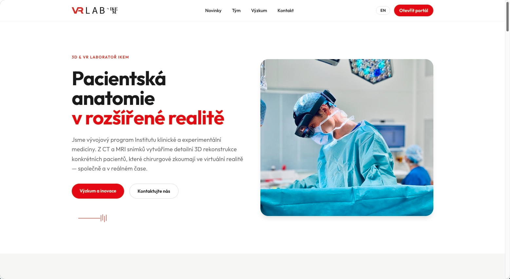
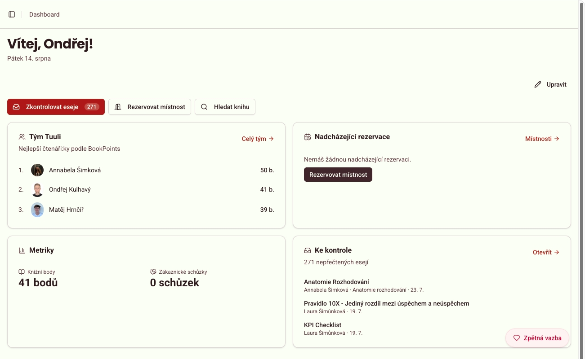

# 👋 Hi, I'm Ondřej Kulhavý

**Full-Stack & VR Developer** building 3D & VR medical systems at [IKEM](https://www.ikem.cz/en/) · **Full Stack Engineer** at [WeBe](https://webe.tuuli.cz/) · Student at Tiimiakatemia Prague

I turn patient MRI/CT scans into interactive 3D models that surgeons explore in VR and AR before they step into the operating room.

### 🚀 Projects

#### [VR Lab Portal](https://vrlab.ikem.cz/landingpage) · IKEM
The platform behind VRLab: stores, previews, and pushes patient-specific 3D reconstructions straight to surgical teams' VR/AR headsets — deeply integrated with IKEM's hospital information system.

  

#### [Tappka](https://tiimi.cz/) · Tiimiakatemia Prague
The student portal my team actually runs on: interactive book library, essay management, and room scheduling — built to fix our daily operational bottlenecks.

  

### 🛠️ Stack

I live in the terminal — Neovim, tmux, and a good CLI are my home base.

**Languages & frameworks:** Python · Django · C#/.NET · TypeScript · React
**XR & 3D:** Unity · OpenXR · Magic Leap 2 · Blender
**Workflow:** Neovim · tmux · Docker · PostgreSQL · Git

### 🎓 Education

- **Innovative Entrepreneurship (Tiimiakatemia®)** — [CZU Prague](https://ip.pef.czu.cz/), 2025–2028
- **Information Technology** — [SPŠE Ječná](https://www.spsejecna.cz/), 2020–2024

### ☕ Beyond code

Theater · Gym · Oil painting · Coffee

